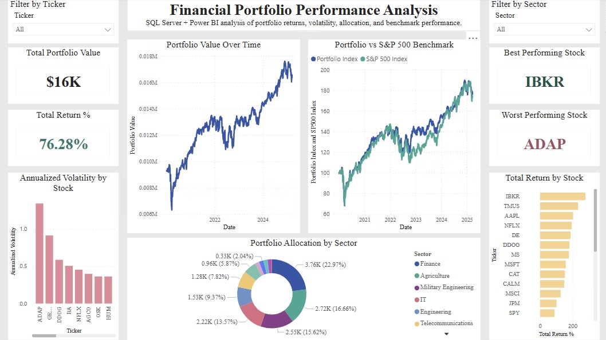

# Financial Portfolio Performance Analysis

## Project Overview
This project analyzes a stock and ETF portfolio using SQL Server and Power BI. The goal was to evaluate portfolio performance, asset returns, volatility, sector allocation, and benchmark performance against the S&P 500.

## Tools Used
- SQL Server Management Studio
- Power BI
- SQL
- DAX
- Yahoo Finance-style historical stock data

## Key Questions
1. Which assets had the highest return?
2. Which assets were most volatile?
3. How did the portfolio perform compared to the S&P 500?
4. What sectors made up the portfolio?
5. Which holdings contributed most to gains/losses?

## Dashboard Preview

## SQL Skills Demonstrated
- JOINs
- GROUP BY
- CASE WHEN
- CTEs
- Window functions: LAG(), ROW_NUMBER(), FIRST_VALUE()
- Aggregate metrics
- SQL views

## Key Insights
- IBKR was the best-performing holding.
- ADAP was the weakest-performing holding.
- The portfolio generated a 76.28% total return.
- The dashboard compares portfolio performance against the S&P 500 benchmark.
- Sector allocation and volatility analysis helped identify concentration and risk exposure.

## Files
- `data/` contains the source CSV files.
- `sql/` contains SQL view creation scripts.
- `powerbi/` contains the Power BI dashboard file.
- `images/` contains dashboard screenshots.

## Dashboard
The Power BI dashboard includes:
- Total portfolio value
- Total return %
- Best and worst performing stocks
- Portfolio value over time
- Sector allocation
- Annualized volatility
- Portfolio vs. S&P 500 benchmark
